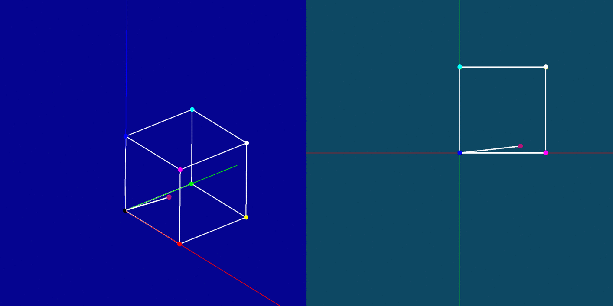

# rgb-rotation

An attempt to visualize how Hue is calculated from RGB.



## Usage

Run `lein figwheel` in your terminal. Wait for a while until you see `Successfully compiled "resources/public/js/main.js"`.

Open [localhost:3449](http://localhost:3449) in your browser.

## Build

Run

```
lein do clean, cljsbuild once optimized
```

This will compile your code and run Google Closure Compiler with advanced optimizations. Take `resources/public/index.html` and `resources/public/js/main.js` and upload them to server of your choice.

## Task list

- [x] Animate matrix rotation with top projection
- [x] Add color input & animation controls
- [x] Draw the input color's hexagon
- [ ] Display rotation matrix used for each step

## License

MIT © Nathan Dao
